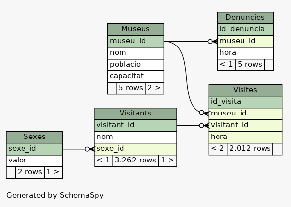

L’amenaça als museus
===============================

Es va rebre un anònim a l’Ajuntament on hi havia l’amenaça de robar en diversos museus de la ciutat. Els museus de la ciutat van rebre una amenaça de robatori però no s’ho van prendre seriosament perquè:

* Tots tenen una alarma “Direct Secure” connectada amb la policia.
* Tots els visitants que entren en algun dels museus són obligats a identificar-se.

Però tot i les precaucions i les mesures de seguretat l’amenaça s’ha complert i hi ha hagut robatoris en uns quants dels museus de la ciutat!

El gran detectiu **Sherlock “Informatic” Holmes** ha vingut a intentar ajudar-nos i ràpidament ha deduït que tots els robatoris han estat fets per la mateixa gent i de deduir que el robatori l’ha fet la mateixa gent.

Però la quantitat de dades és molt gran i per tant ha decidit entrar totes les dades que arriben de cada museu en una base de dades relacional que té aquesta estructura:

S’ha creat una taula _“Visites”_ conté cada un dels clients que hi havia en el museu en una hora determinada i s’ha entrat en la taula “Denúncies” en quin moment es van produir els robatoris en cada museu.

## Tasca

1.  Sherlock “Informàtic” Holmes no sap res d’informàtica (ups!) i per això us demana a vosaltres que li feu un programa que determini quines persones eren en els museus en el moment en que es van produir els robatoris per determinar qui van ser els lladres.

Recordeu que ha deduït que els lladres sempre anaven junts a tots els robatoris.

> Podeu descarregar una còpia de la base de dades d'[Aquí](https://drive.google.com/file/d/1lF2grKTyYZJqAh9F6DuK61gscZhJ9ufg/view?usp=sharing)
>
> I hi ha una altra Base de dades diferent [Aquí](https://drive.google.com/file/d/1E27wssmMpxNk4vdGAhTNZrSObXxxBgg_/view?usp=sharing)
